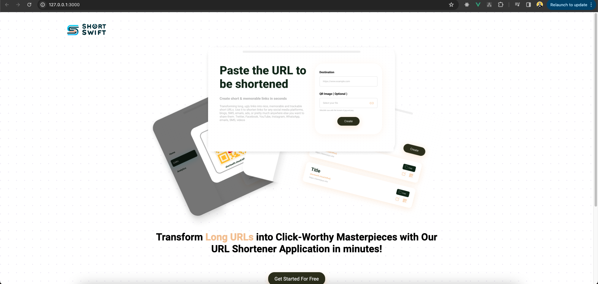

## Introduction

Transforming long, ugly links into nice, memorable and trackable short URLs. Use it to shorten links for any social
media platforms, blogs, SMS, emails, ads, or pretty much anywhere else you want to share them.****

## Tools that been used

1. FastAPI
2. Jinja
3. Postgres

## Flow

1. Landing Page
2. Login Page
3. List URL
4. Create URL

## How To Run

```
    python3 -m venv venv
    source venv/bin/activate
    pip3 install -r requirements.txt
    python3 main.py
```

or

```
    docker-compose up --build
```

## Image sample


